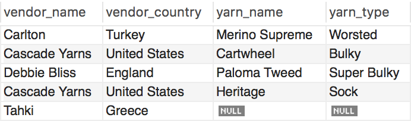

# SQL Joins

## Part 1

Describe the different types of join clauses supported in SQL.
 * INNER JOIN: Joins and returns records that are matched in both tables.
 * LEFT JOIN: Joins and returns all records from the left table and matching records from the right table.
 * RIGHT JOIN: Joins and returns all records from the right table and matching records from the left table.
 * FULL OUTER JOIN: Joins and returns all records from the left and right tables.

## Part 2

* Consider the following tables:

  * vendor_table

  

  * yarn_table

  

Which join was used to create the final view below? 

  

__FULL OUTER JOIN__ Because it returns all records from the left and right tables.